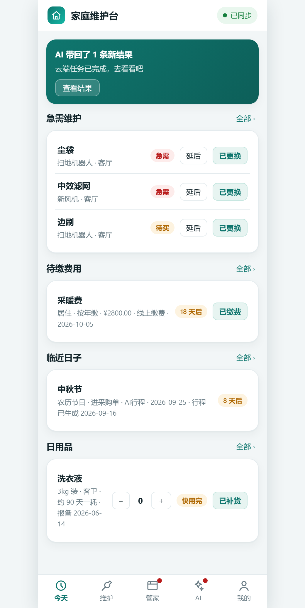
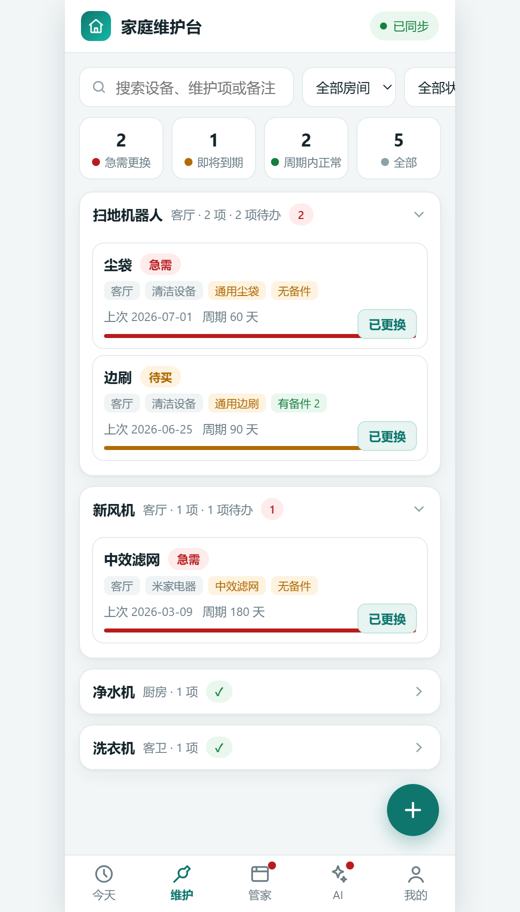
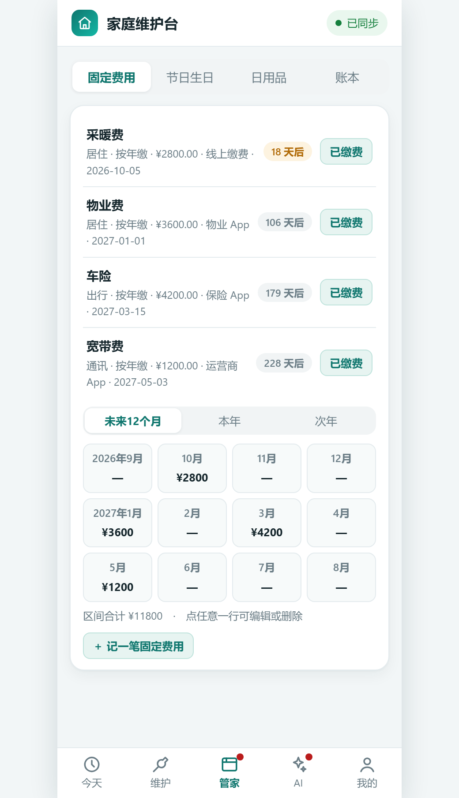

# 发布说明（给维护者看）

本文档说明这个仓库里有什么、怎么发出去、有哪些注意事项。**面向维护者，不是面向使用者。**

---

## 一、这个仓库包含什么

```
github-package/                  ← 仓库根（在这里 git init）
├── README.md                    ← 主文档（对外门面）
├── LICENSE                      ← MIT
├── .gitignore                   ← 排除规则
├── .gitattributes               ← 统一换行符为 LF
├── 发布说明.md                   ← 本文件
│
├── page_v9/
│   ├── index.html               ← 主程序（已脱敏，ID 已占位化）
│   └── _s0.js                   ← 主脚本抽出快照（便于阅读）
│
├── demo/                        ← 离线演示环境（零配置可跑）
│   ├── demo5.html               ← 演示入口（已脱敏）
│   ├── mock4.js                 ← 模拟 SDK + 虚构数据（已脱敏）
│   ├── showcase.html            ← 对外介绍页
│   └── s_*.png × 8              ← 界面截图
│
└── docs/
    ├── 项目结构说明.md            ← 代码导览
    ├── 依赖与运行环境.md          ← 环境清单 + SDK 契约
    ├── 使用说明与快速上手.md       ← 三种角色上手路径
    ├── 数据模型.md               ← 17 张表字段定义
    ├── AI任务配置.md             ← 云端巡检配置
    └── 未来升级方向.md            ← 路线图
```

---

## 二、发布前已做的处理

### ✅ 2.1 脱敏（分两轮）

**第一轮**——品牌与设备信息：

| 类别 | 原值 | 处理 |
|---|---|---|
| 宠物名 | 两只猫的真实名字 | → "示例宠物" |
| 设备品牌型号 | 洗衣机/新风机/净水机/扫地机/猫厕所/饮水机等的真实型号 | → 泛化为通用名称 |
| 品牌名 | 出现在类别、耗材型号里的品牌 | → 泛化（如"XX 品牌"→"宠物设备"） |
| 具体设备清单 | `FALLBACK_OPTS` 里的 12 项真实设备 | → 11 项通用设备名 |
| 耗材型号清单 | `MODEL_PRESET` 里的 21 项真实耗材 | → 20 项通用耗材名 |

**第二轮**——资源标识与个人信息（**第一轮漏掉的**）：

| 类别 | 原值 | 处理 |
|---|---|---|
| **真实数据表 ID** | 17 张表的真实 ID，共 37 处，分布在 5 个文件 | `index.html` → `YOUR_*_DB_ID` 占位符；`demo5.html`/`mock4.js` → 一致的假 ID（保证演示仍可跑） |
| **空间 ID / 页面节点 ID** | 真实的空间与页面标识 | → 假值 |
| **真实生日** | 成员数据里的本人及家人生日、宠物生日 | → 无关的示例日期 |
| 个人状态描述 | 偏好设置里一句暴露个人生活状态的表述 | → 中性表述 |
| **内部设计文档** | `design/` 下两份文档（内部汇报体：用对话式口吻写给决策人看，含内部称呼、真实生日、空间 ID、表 ID） | → **整目录移除**（详见 2.3） |

**验证方法**（可重复执行）：

敏感词表**放在仓库外**，不要把词表本身提交进仓库——否则脚本就成了新的泄露源。每行一个词：

```bash
# ../sensitive-words.txt 内容示例（这几行是格式说明，不是真实词表）：
#   <品牌名>
#   <真实人名或宠物名>
#   <资源 ID>
#   <真实生日>
#   <内部称呼>

cd github-package
python -c "
import glob,os
words=[l.strip() for l in open('../sensitive-words.txt',encoding='utf-8') if l.strip()]
for f in glob.glob('**/*',recursive=True):
    if not os.path.isfile(f) or f.endswith('.png') or f.startswith('.git'): continue
    try: s=open(f,encoding='utf-8').read()
    except: continue
    hit=[w for w in words if w in s]
    if hit: print('HIT',f,hit)
print('done')
"
```

**当前结果：零命中。**

> ⚠️ **唯一遗留**：8 张截图 `demo/s_*.png` 是真实界面截图，**没有逐张肉眼核查**。发布前请自己看一遍；如含真实设备名或家人姓名，重新截图或直接删掉。

### ✅ 2.2 剔除的文件

| 已剔除 | 原因 |
|---|---|
| `.workbuddy/` | 工作记录、自动化配置、可能含真实业务数据 |
| `.cudshare/` | Chrome 用户数据目录残留（崩溃日志、扩展缓存），非项目源码 |
| `maintenance_backup.json` | 真实家庭数据备份（26 条记录） |
| `page-backups/` | 本地历史备份 |
| `demo/demo.html` ~ `demo4.html` | 中间版本，已被 `demo5.html` 取代 |
| `demo/mock.js` ~ `mock3.js` | 中间版本 |
| `demo/base.html` / `measure.html` | 开发过程文件 |
| `云上模式定时任务-提示词.md` | 含内部部署细节 |
| `家庭维护台-对外说明与征集.md` | 含内部征集内容 |
| `家庭维护台-朋友征集文案.md` | 同上 |

这些已在 `.gitignore` 里配置排除。它们都位于**原项目工作目录**，发布包目录（`github-package/`）本来就不包含，所以不会有被误提交的风险。

### ✅ 2.3 移除的目录：`design/`

发布包里原本还有两份架构设计文档（`架构设计v1.md` / `架构设计v2.md`），已**整目录移除**。

**原因**：

| # | 判断 |
|---|---|
| 1 | **内容是内部汇报体，不是对外技术文档**：通篇对话式口吻、直接对决策人说话（"您研究过某方案，正好用上""这是我方建议，最终路线请拍板"），属于内部决策口径 |
| 2 | **含硬隐私**：真实生日、空间 ID、数据表 ID、自动化任务 ID |
| 3 | **不在本次交付范围内**：需求要的是 README / 项目结构 / 依赖清单 / 使用说明 / 未来规划，未包含设计文档 |
| 4 | **脱敏成本高于保留价值**：要改称呼、ID、日期、内部判断口径，改写之后已不再是原文档；而其核心信息已在 `docs/项目结构说明.md` 和 `docs/未来升级方向.md` 里重新组织过 |

如需保留演进记录，建议体现为 **git 提交信息**，而不是把内部汇报原文放进仓库。

> 原文件仍在项目工作目录中，此处只移除了发布包内的副本，未做任何删除。

### ✅ 2.4 语法校验

所有 JS 文件通过 `node --check`：

```bash
node --check demo/mock4.js     # OK
node --check page_v9/_s0.js    # OK（主脚本抽出快照）
node --check demo/demo5.html   # OK（抽出主脚本后校验）
```

---

## 三、发布步骤

### 3.1 建仓库

```bash
cd github-package
git init
git add .
git status          # 确认没有敏感文件被加进来
git commit -m "feat: 家庭维护工作台 v1"
git remote add origin <你的仓库地址>
git push -u origin main
```

### 3.2 发布前最后检查

```bash
# 1. 敏感信息扫描（词表放仓库外，格式与用法见 2.1 节）
python -c "
import glob,os
words=[l.strip() for l in open('../sensitive-words.txt',encoding='utf-8') if l.strip()]
for f in glob.glob('**/*',recursive=True):
    if not os.path.isfile(f) or f.endswith('.png') or f.startswith('.git'): continue
    try: s=open(f,encoding='utf-8').read()
    except: continue
    hit=[w for w in words if w in s]
    if hit: print('HIT',f,hit)
print('clean check done')
"

# 2. JS 语法校验
node --check demo/mock4.js
node --check page_v9/_s0.js

# 3. 确认没有真实数据文件
ls -la | grep -i backup    # 应该没有输出

# 4. 确认 .gitignore 生效
git status --ignored | head -20
```

### 3.3 补一张截图

README 里没有内嵌图片（因为图片在 `demo/` 下，README 里引用需要相对路径）。如果你想让首页有图，在 README 开头加：

```markdown
| 今天 | 维护 | 台账 |
|---|---|---|
|  |  |  |
```

**注意先检查这些图是否含真实数据。**

---

## 四、给朋友的测试路径

如果你把仓库发给朋友，推荐这样引导：

### 第一步：零配置看效果

```
clone 仓库 → 打开 demo/demo5.html
```

**这一步不需要任何账号、不需要联网、不需要装东西。**

### 第二步：读文档

推荐顺序：

1. `README.md` —— 理解这是什么、为什么这么做
2. `docs/使用说明与快速上手.md` 第一节 —— 看懂界面
3. `docs/项目结构说明.md` —— 理解代码
4. `docs/数据模型.md` —— 如果要自己部署

### 第三步：改代码

按 `docs/使用说明与快速上手.md` 第二节的"建立你自己的开发页"，5 分钟能跑通改代码的循环。

### 第四步（可选）：部署

按 `docs/使用说明与快速上手.md` 第三节。**建议先只建 7 张表**，不要一次建 17 张。

---

## 五、已知的发布风险

| 风险 | 说明 | 处理 |
|---|---|---|
| **截图可能含真实数据** | `demo/s_*.png` 是真实界面截图 | ⚠️ **发布前必须自己看一遍** |
| 平台强依赖 | 完整版需要特定平台，朋友可能没有 | 已在 README"已知限制"说明；离线演示可跑 |
| 数据表 ID 硬编码 | `page_v9/index.html` 里是原表的 ID | 已在文档说明需要替换 |
| 无自动化测试 | 验证靠人工 | 已在"已知限制"说明 |

---

## 六、后续维护建议

### 每次改代码后

1. 跑一遍语法校验
2. 刷 `demo/demo5.html` 看效果
3. 同步更新 `page_v9/index.html` 和 `demo5.html`（如果是通用改动）
4. 如果新增了表，同步更新文档里的表清单

### 每次加新表后

必须同步四处，**漏一处就出问题**：

| # | 位置 | 漏掉会怎样 |
|---|---|---|
| 1 | `DB` 常量 | 页面读不到这张表 |
| 2 | `SNAP_NAMES` | **这张表没有备份** |
| 3 | `Store.loadAll` 的加载清单 | 页面不加载它 |
| 4 | `docs/数据模型.md` | 文档与实际不一致 |

### 文档与代码的一致性

本项目文档量比代码量大（文档约 5 万字 vs 代码约 5 千字），好处是解释充分，风险是**容易过期**。

**建议**：改代码时如果影响了文档描述，同一轮就改文档。特别是这几处容易过期：

- `docs/项目结构说明.md` 里的行号
- `docs/数据模型.md` 里的字段清单
- README 里的功能列表

---

## 七、发布后的可选动作

| 动作 | 说明 |
|---|---|
| 加 Topics | `home-automation` / `maintenance` / `vanilla-js` / `single-file` / `pwa` |
| 加截图到 README | 见 3.3 节 |
| 写 CONTRIBUTING.md | 如果希望别人参与 |
| 开 Issues 模板 | 如果预计有人反馈问题 |

**但也不必都做。** 这个项目的本质是"给自己家用的"，发布出来主要是给朋友参考。**README 写清楚、demo 能跑起来，就已经达到目的了。**
